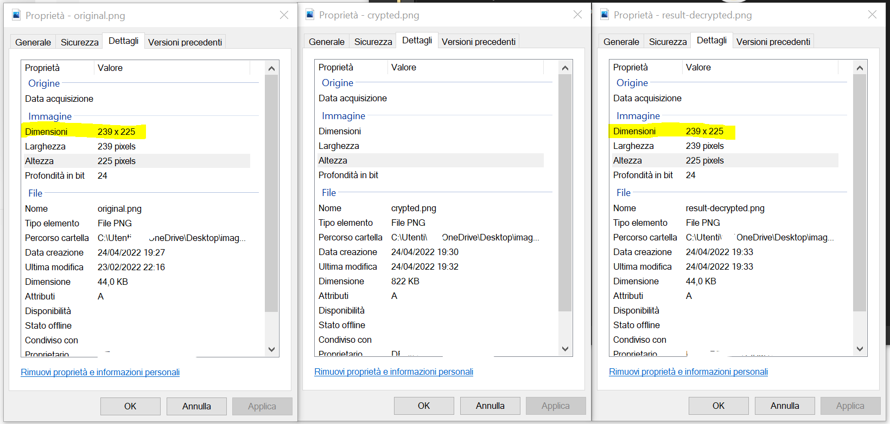
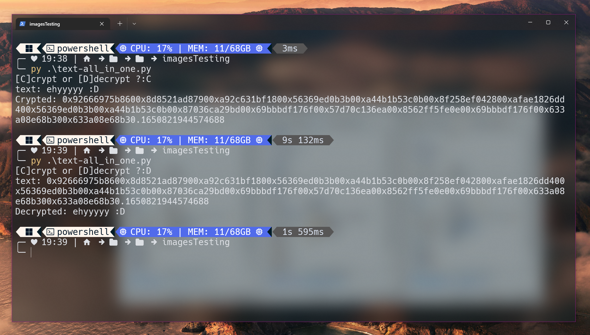

# JUC
JUC is a simple Unicode based text crypter


note: *You can find all the examples in the folder `examples`*


# Installation
You can find the project on [PyPi](https://pypi.org/project/JUC/).
To install it execute this command in the cmd
```yaml
pip install JUC
```

# Preview
> ### File Encrypter
> 
> ### Original and decrypted file differences
> 
> The quality of the original file and the decrypted file is equal :)
> 
> ### Text Crypter
> 

# Examples

> ### Encrypting a text
> ```py
> from JUC import *
> worker = Juc('YourSecretKey')
> print(worker.crypt(b'ehy, hello there'))
> ```
> ### Decrypting a text
> ```py
> from JUC import *
> worker = Juc('YourSecretKey')
> print(worker.decrypt(text).decode())
> ```


> ### Encrypting a file
> ```py
> from JUC import *
> 
> worker = Juc('YourSecretKey')
> 
> filePath = 'image.png'
> 
> with open(f'result.png', 'wb') as f:
>     with open(filePath, 'rb') as file:
>         content = file.read()
>         crypted = worker.crypt(content)
>         f.write(crypted.encode())
> ```
> ### Decrypting a file
> ```py
> from JUC import *
> 
> worker = Juc('YourSecretKey')
> 
> filePath = 'result.png'
> fileType = filePath.split('.')[-1]
> 
> with open(filePath, 'r') as file:
>     content = file.read()
>     with open(f'result-decrypted.{fileType}', 'wb') as f:
>         decrypted = worker.decrypt(content, False)
>         f.write(decrypted)
> ```
